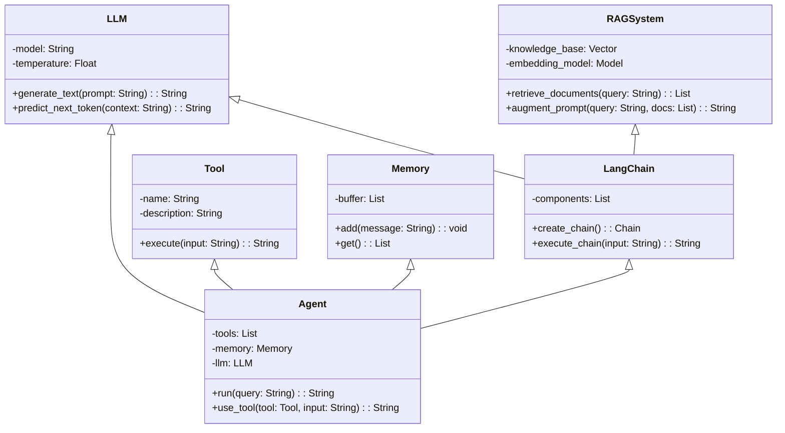

# Using UML Diagrams to Explain AI Agent Workshop Content

UML (Unified Modeling Language) diagrams are powerful visualization tools that can help clarify the structure, behavior, and interactions within a system. They're particularly useful for explaining the AI Agent Workshop content we discussed earlier. Let's use various UML diagrams to better illustrate the key components and relationships in our workshop.

## Class Diagram for AI Agent Components

A class diagram shows the static structure of the system, including classes, attributes, methods, and relationships between classes.




## Deployment Diagram for Workshop Setup

A deployment diagram shows the physical deployment of artifacts on nodes.

```mermaid
graph TD
    A[Student Laptop] --&gt; B[Jupyter Notebook]
    B --&gt; C[Python Environment]
    C --&gt; D[LangChain Library]
    C --&gt; E[OpenAI API Client]
    C --&gt; F[Vector Database Client]
    G[Cloud Services] --&gt; H[OpenAI API]
    G --&gt; I[Vector Database Service]
```

These UML diagrams provide a comprehensive visual representation of the AI Agent Workshop content, illustrating the structure, behavior, and interactions of the various components. They help students understand the relationships between different concepts like LLMs, RAG, LangChain, Agents, and Tools, making the workshop material more accessible and easier to grasp[^2][^3][^5].

By incorporating these diagrams into the workshop materials, students will have visual references that complement the code examples and theoretical explanations, enhancing their learning experience[^7][^9].

<div>⁂</div>

[^1]: https://mermaidjs.github.io

[^2]: https://www.restack.io/p/uml-vs-erd-ai-project-planning-answer-understanding-uml-diagrams

[^3]: https://www.restack.io/p/uml-modeling-answer-examples-ai-projects

[^4]: https://langchain-ai.github.io/langgraph/concepts/agentic_concepts/

[^5]: https://miro.com/ai/uml-diagram-ai/

[^6]: https://github.com/mfoud444/UML-AI-Generator

[^7]: https://www.restack.io/p/uml-diagram-project-examples-answer

[^8]: https://www.falkordb.com/blog/building-ai-agents-with-memory-langchain/

[^9]: https://diagrammingai.com

[^10]: https://www.lucidchart.com/pages/examples/uml_diagram_tool

[^11]: https://www.gptechblog.com/5-diagrams-to-help-you-understand-generative-ai/

[^12]: https://python.langchain.com/docs/tutorials/rag/

[^13]: https://creately.com/blog/diagrams/uml-diagram-types-examples/

[^14]: https://chatuml.com

[^15]: https://realpython.com/build-llm-rag-chatbot-with-langchain/

[^16]: https://venngage.com/blog/uml-diagram-examples/

[^17]: https://python.langchain.com/v0.2/docs/tutorials/rag/

[^18]: https://miro.com/diagramming/uml-diagram-examples/

[^19]: https://dzone.com/articles/ai-is-transforming-how-we-use-software-diagrams

[^20]: https://langchain-ai.github.io/langgraph/tutorials/rag/langgraph_agentic_rag/

[^21]: https://www.lucidchart.com/pages/uml-class-diagram

[^22]: https://www.lucidchart.com/pages/uml-sequence-diagram

[^23]: https://neurons-lab.com/article/intro-to-llm-agents-with-langchain-when-rag-is-not-enough/

[^24]: https://www.langchain.com/langgraph

[^25]: https://www.mymap.ai/uml-chart-maker

[^26]: https://www.eraser.io/ai/uml-diagram-generator

[^27]: https://www.eraser.io/diagramgpt

[^28]: https://www.youtube.com/watch?v=WnMQ8HlmeXc

[^29]: https://towardsdatascience.com/ai-agent-workflows-a-complete-guide-on-whether-to-build-with-langgraph-or-langchain-117025509fa0/

[^30]: https://www.youtube.com/watch?v=9rsVIVvyFZE

[^31]: https://model-engineering.info/publications/papers/EmpER24-UML-Look-Sound.pdf

[^32]: https://www.youtube.com/watch?v=buET5brQHFQ

